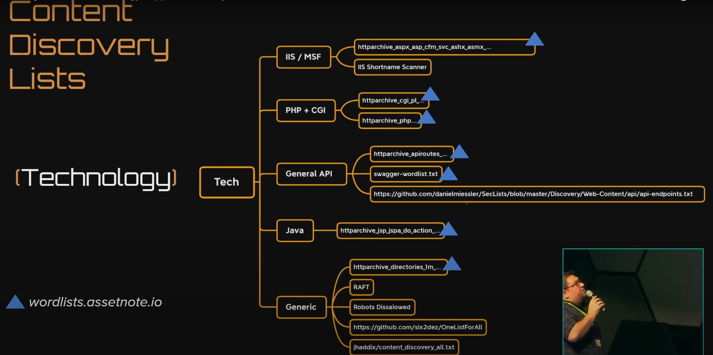
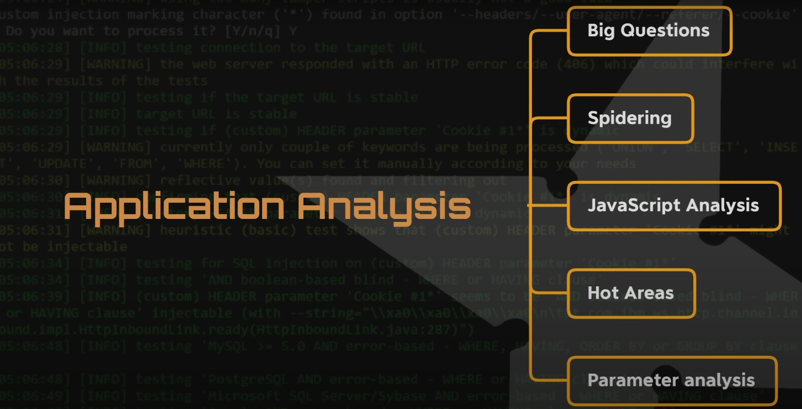
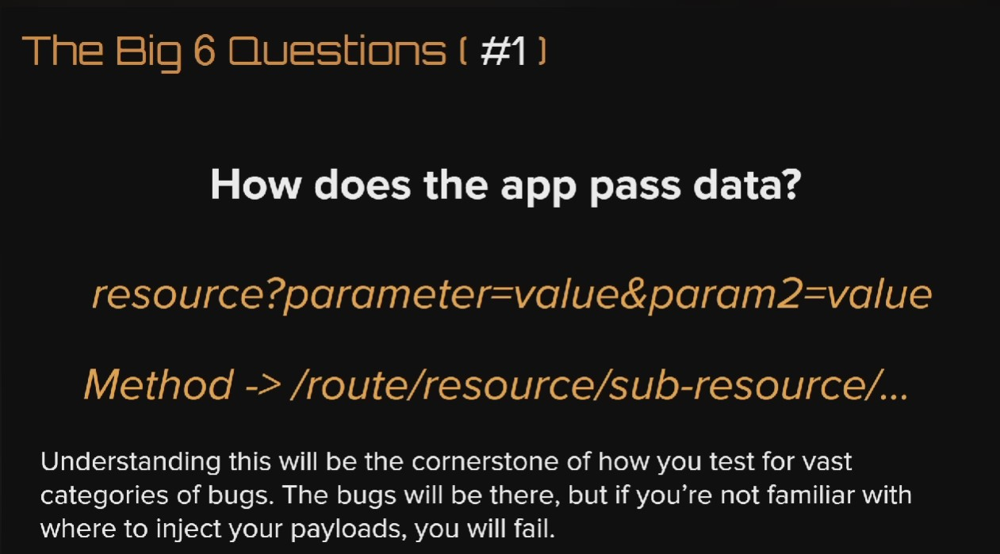
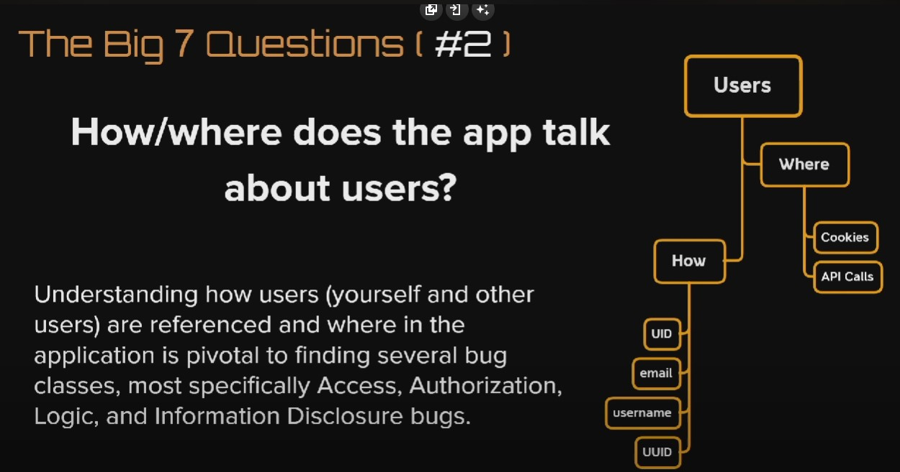
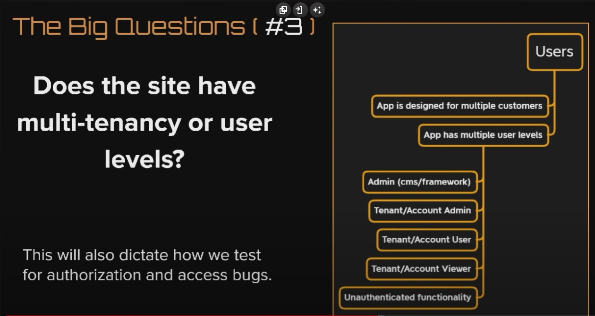
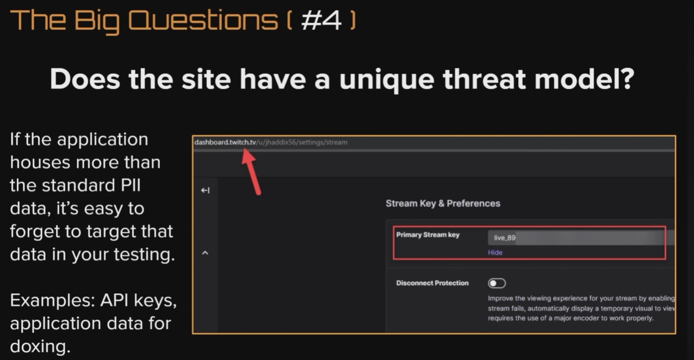
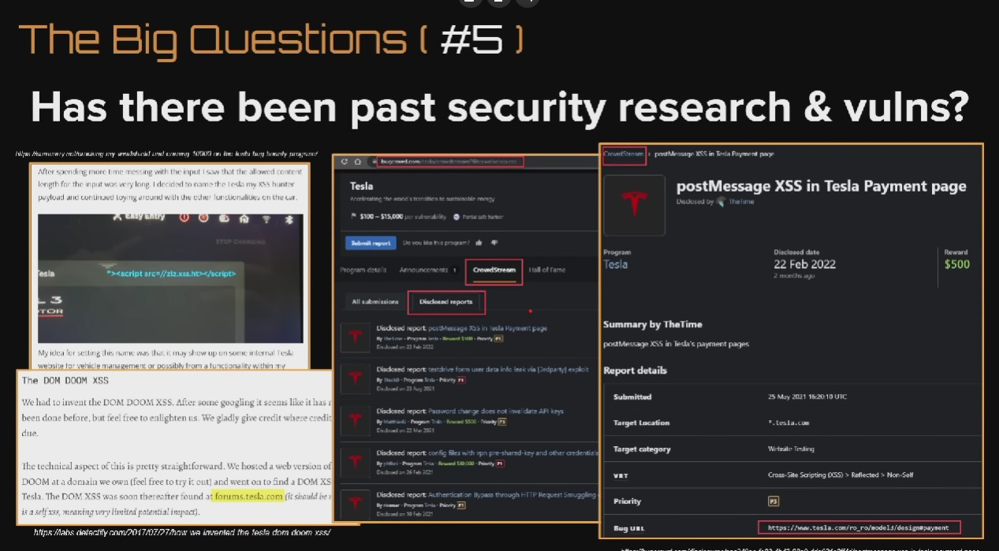
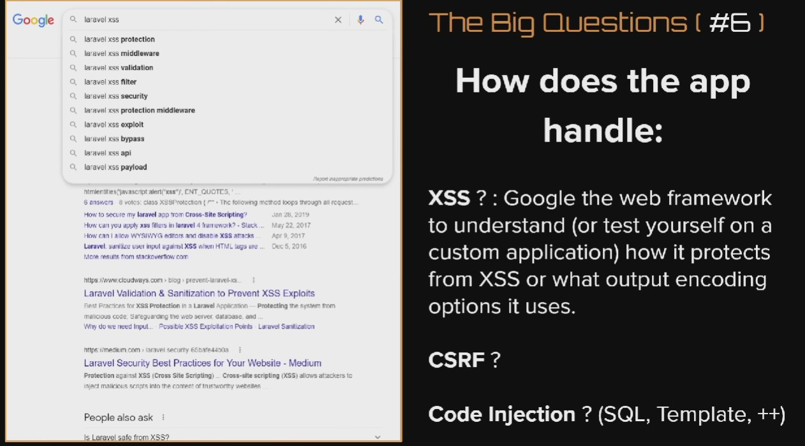
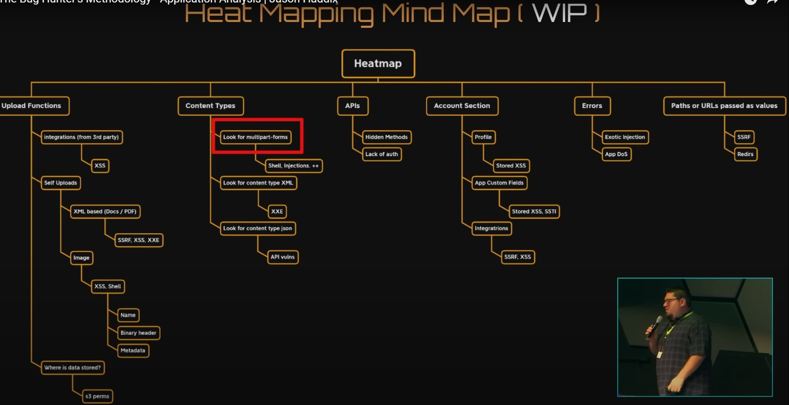

# Enumeration
 - `assetfinder` is great for finding subdomains. `assetfinder domain.com`. `--subs-only` if u want related only.
 - `amass enum -d domain.com`
 - `cat domains | httprobe -s -p https:443` to ensure the domain is alive.
 - test, dev, admin domain would be interesting.
 - `gowitness` screenshot of website, wohoooo. https://github.com/sensepost/gowitness .
 - The script https://pastebin.com/MhE6zXVt
 - Use the excel checklist as well [OWASP LINK](https://github.com/tanprathan/OWASP-Testing-Checklist) . Added here [CheckList](OWASP_WSTG_Checklist.xlsx).

# Methodology.
 - Notes from this talk [Youtube Video][https://www.youtube.com/watch?v=FqnSAa2KmBI&t=1624s&ab_channel=HackerOne]
 - 
 - What tehcnology is being used Whatrun, Whatweb, Wappalyzer
 - Nuclei to find CVEs, Look at tweets, your own tweetdeck and create custom templates.
 - Tools for initial:
    - [GoFingerPrint](https://github.com/Static-Flow/gofingerprint) (For getting webser info ).
    - [Sn1per](https://github.com/1N3/Sn1per) (offensive security framework, discover attack surface) tutorials in https://www.youtube.com/c/Sn1perSecurity/videos
    - [intrigue-core](https://github.com/intrigueio/intrigue-core) (for attack surface discovery as well)
    - [Burp Extension](https://github.com/vulnersCom/burp-vulners-scanner) (burp extension, professional version required)
    - [Retire.js](https://github.com/retirejs/retire.js/) (for js vulnerabilities)
    - [Jaeles scanner](https://jaeles-project.github.io/installation/) (another vulnerability scanner)
    - [RustScan](https://github.com/RustScan/RustScan) (Fastest port scanner till now ).
 - Tools for content discovery (most bug reports)
    - [ffuf](https://github.com/RustScan/RustScan).
    - [wfuzz](https://github.com/xmendez/wfuzz).
    - [gobuster](https://github.com/OJ/gobuster).
    - [Scavenger](https://github.com/0xDexter0us/Scavenger), build wordlist from words in website.
    - Tools are only as good as their wordlists 
    - [Technology specific Wordlists](https://wordlists.assetnote.io).
    - [Seclist](https://github.com/danielmiessler/SecLists).
    - Config files, where are they for the particular framework? db config string. Ex: AppSettings.json in IIS. ASP.net
    - [WordlistFromSource](https://github.com/danielmiessler/Source2URL/blob/master/Source2URL).If you have the source code.
    - Does it have a docker image, look inside for extra info, source code?
    - Try to get a demo.
    - [gau](https://github.com/lc/gau) fetch historic URL.
    - [waymore](https://github.com/xnl-h4ck3r/waymore) like gau, but gives extra info.
    - Do recursion as well.
    - [apkleaks](https://github.com/dwisiswant0/apkleaks) Grab URLS from apks.
    - Be updated on the changes they made subscribe to news letter, https://changedetection.io , new features. confrences talks.
 - Application Analysis
    - 
    - Six big questions
    -  
    - 
    -  
    - Contextual threat 
    - 
    - 
    - Spidering, ZAP (attack and spider), Burp (crawl), CLI [hackrawler](https://github.com/hakluke/hakrawler), [GOSpider](https://github.com/jaeles-project/gospider)
    - Javascript, find js in a domains.
       - [xLinkFinder](https://github.com/xnl-h4ck3r/xnLinkFinder).
    - Parameter Analysis
       - [Most Common Vuln Statistically](https://github.com/bugcrowd/HUNT/blob/master/Burp/conf/issues.json).
       - [Similar to above](https://github.com/1ndianl33t/Gf-Patterns).
    - Heat Mapping
       - Where things might go bad. spidy sense?
       - .
