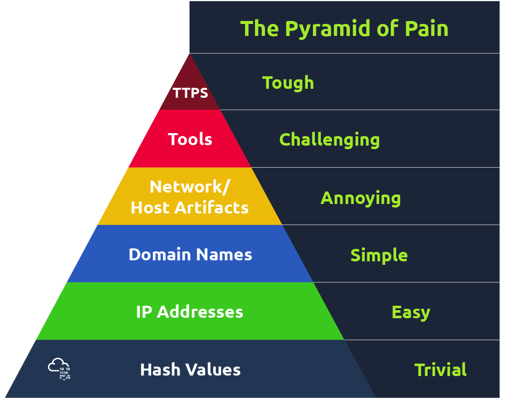
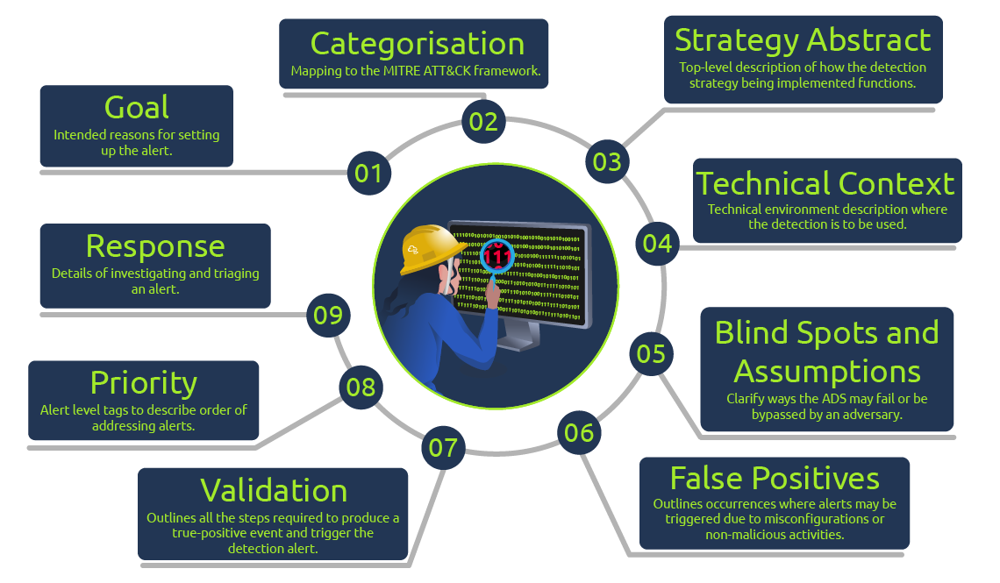
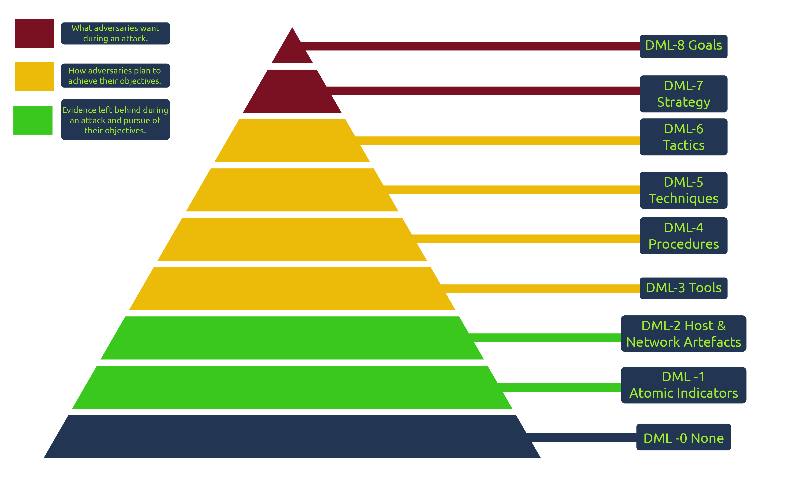

# Detection Engineering
- Detection engineering is the continuous process of building and operating threat intelligence analytics to identify potentially malicious activity or misconfigurations that may affect your environment. It requires a cultural shift with the alignment of all security teams and management to build effective threat-rich defence systems.

## Types
1. Environment based: focuses on lookin at changes in environment based on configuration and baseline
    - configuration detection: with current knowledge of infra, identify misalignments.
    - modelling: defline baselin operation, and detect any deviations from it.
2. Threat based: focuses on elements associated with an adversary’s activity, such as tactics, tools and artefacts that would identify their actions.
   - Indicator Based: detect using IOCs
   - Threat Behavior detection: be aware of adversaries TTP and detect. MITRE perhaps

## Detection as code
- observe malicious as behavior
- model it in code, like sigma, yara.
- write test cases.
- commit to version control
- deploy to testing.
- deploy to production.
- tune and update.

## Detection engineering methodologies
1. Gap analysis: look for key areas to focus on. Thread modelling. Reactive (look at incident reports) , proactive (use mitre ATTK&CK).
2. Data source identification log collection: Do baselining first.
3. Rule writing: Yara, Sigma.

## Detection engineering frameworks
- The [ATT\&CK framework ](https://attack.mitre.org/)helps map out adversarial actions based on the infrastructure in use for detection engineering. It guides what to look for, especially as part of the detection gap analysis phase.
- [Cyber Analytics Repository](https://car.mitre.org/)
- Pyramid of pain: <!--StartFragment-->

if the defenders detect their TTPs, then how difficult and/or costly it would be for the adversary to change their TTPs

<!--EndFragment-->

Image Source: https://tryhackme.com/room/introtodetectionengineering
- Cyber kill chain
<!--StartFragment-->

*   Reconnaissance
*   Weaponisation
*   Delivery
*   Exploitation
*   Installation
*   Command & Control
*   Actions on Objectives

<!--EndFragment-->
- The unified kill chain is the improved version of it.

## Alerting and Detection Strategies Framework
- Desinged to reduce alert fatigue.
- Things the detection engineer must do before creating that alert. Project [LINK](https://github.com/palantir/alerting-detection-strategy-framework?tab=readme-ov-file).

Image Source: https://tryhackme.com/room/introtodetectionengineering
## Detection maturity Maturity model
<!--StartFragment-->

[Ryan Stillions](http://ryanstillions.blogspot.com/2014/04/the-dml-model_21.html) brought forward the Detection Maturity Level (DML) model in 2014 as a way for an organisation to assess its maturity levels concerning its ability to ingest and utilise cyber threat intelligence in detecting adversary actions. According to Ryan, there are two guiding principles for this model:

1.  An organisation's maturity is not measured by its capabilities of obtaining valuable intelligence but by its ability to apply it to detection and response.
2.  Without established detection functions, there is no opportunity to carry out response functions.

<!--EndFragment-->

# Tactical Detection
- Unique threat intel: unique to current org, IOC from past breaches.
- Convert between different formats uncoder.io.

## Set tripwire
- <!--StartFragment-->

Once the machine has initiated, click on the start icon and type "Local". The Local Security Policy application should appear. Open the application, then navigate to Security Settings → Local Policies → Audit Policy.

<!--EndFragment-->
<!--StartFragment-->

Secret Document". Right-click the document →** **Properties → Security →** **Advanced → Auditing

Click on Add → Select a principal. 

<!--EndFragment-->
- Tool used to view logs was `FullEventLogView`.

# Purple teaming
- perform attack, check what logs are created and what alerts are fired off, if not, need to update stuffs.
- Rooms to look at [tempest](https://tryhackme.com/room/tempestincident) and [MSDT](https://tryhackme.com/room/follinamsdt).