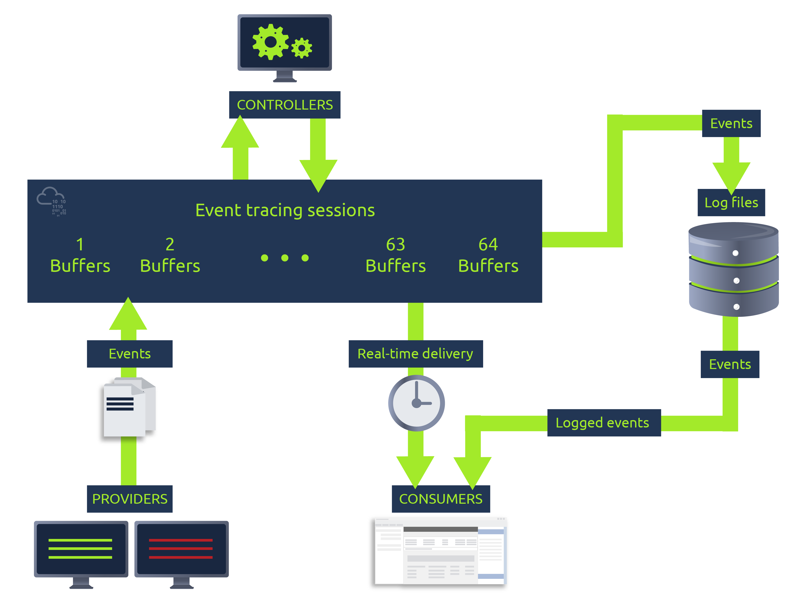

# EDR
- Endpoint Detection and Respnose.
- As the name suggests, detection and response in end devices.

## Event Tracing for windows
ETW is made up of three distinct parts:
- **Controllers:** These applications are used to configure event tracing sessions. They also initiate the providers. An example of a Controller is `logman.exe.`
- **Providers:** These are the applications that produce event logs.
- **Consumers:** These applications subscribe and listen to events in real-time or from a file.

picture from tryhackme

## Aurora
- Its an EDR, installed in windows.
- Like sysmon, but not on kernel level. Aurora uses Event Tracing for Windows(ETW) unlike sysmon which uses Sysmon kernel driver.
- It uses Sigma rules to detect.
- Can run in command line once, or as a long running service.
- Run once <!--StartFragment-->

aurora-agent.exe -c agent-config-minimal.yml

<!--EndFragment-->
- Long running <!--StartFragment-->

aurora-agent.exe --install -c agent-config-minimal.yml

<!--EndFragment-->
- Can output in file, or event logs (looking at event viewer) or TCP/UDP target.
- Produces less logs than sysmon.
- Response: used to contain the threat. `Suspend`, `Kill` or `Dump`.
- Can also point to a custom script to run.
https://www.nextron-systems.com/aurora/
https://tryhackme.com/room/auroraedr
- After running aurora, `whoami /priv` to trigger a alert for test.

## Aurora Detection Gaps
- Named pipes, these require access to kernel Object handle, solution use `intense` configuration.
- Registry events, solution is same.
- ETW disabled, check for dropped logs.