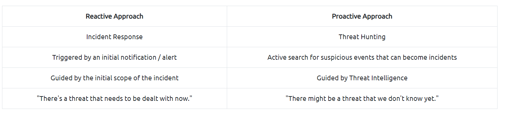
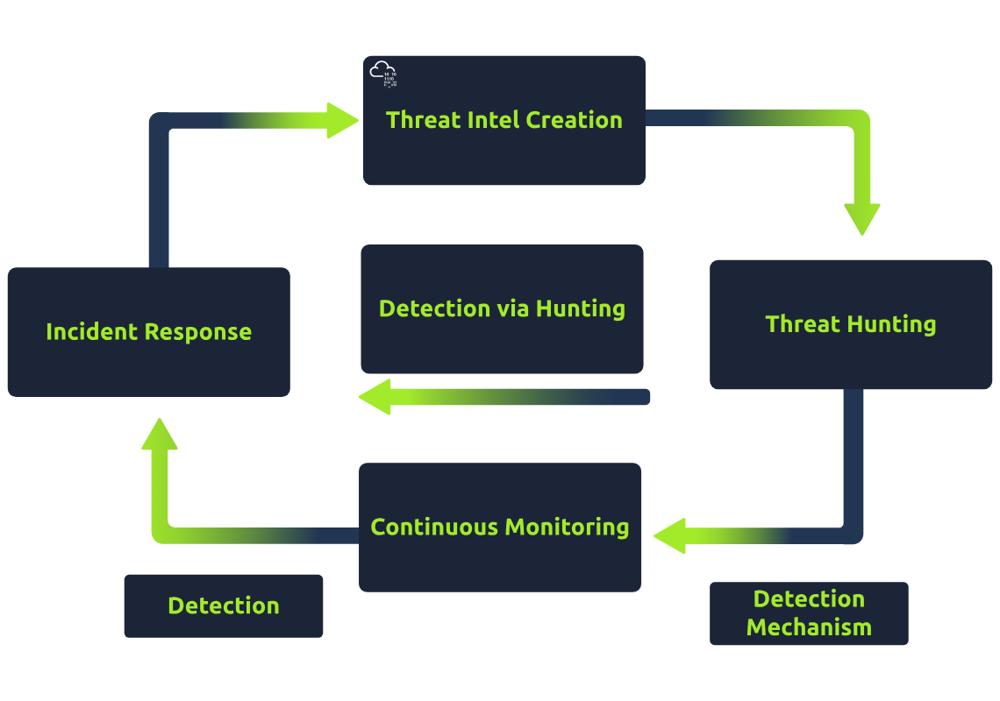

# Threat hunting
- Procatively look for malcious activites, guided by threat intel.
- 2 Screenshots from [tryhackme room](https://tryhackme.com/room/introductiontothreathunting) below:

## Threat Hunting Mindset
<!--StartFragment-->

1.  **People are the Most Important Part of Security Teams:**

    *   While technology is essential, people remain the cornerstone of any security team.
    *   Investing in the proper mindset and skills is crucial alongside tools.

2.  **Starting the Hunt with Accurate Information:**

    *   Begin threat hunting with precise leads, including known malware and trusted Threat Intelligence.
    *   Leads enhance the chances of successful hunts, from basic malicious binary searches to complex group activity patterns.

3.  **Understanding Threat Intelligence:**

    *   Comprehensive understanding of threats helps dictate hunt direction.
    *   It aids in anticipating adversary behavior within the environment and targeting specific data or groups.

4.  **Value of Unique Threat Intelligence:**

    *   Internally developed threat intelligence is highly valuable.
    *   It's unique to the organization and aids in identifying indicators of compromise (IOCs) from previous intrusions.

5.  **Threat Intelligence Feeds:**

    *   Not all organizations can develop actionable threat intelligence internally due to lack of experience, resources, or expertise.
    *   Threat intelligence feeds like MISP provide readily available information.
    *   Paid resources like Recorded Future and ReliaQuest offer tailored intelligence for organizations willing to invest.
    *   While expensive, these services provide valuable insights in the hands of skilled analysts.

<!--EndFragment-->

## Threat Hunting process
<!--StartFragment-->

1.  **Purpose of the Hunt:**

    *   The direction of the hunt is dictated by what is being sought.
    *   Continuous reassessment ensures evidence gathering aligns with the hunt's purpose.

2.  **Types of Valuable Intelligence:**

    *   Known Relevant Malware:

        *   Identify threat actors relevant to the organization and hunt for traces of their malware.
        *   Repositories like [theZoo](https://github.com/ytisf/theZoo) and resources like [Trend Micro’s Threat Encyclopedia](https://www.trendmicro.com/vinfo/us/threat-encyclopedia/) provide insights.

    *   Attack Residues:

        *   Important for post-attack investigation, requires distinguishing from normal behavior.
        *   Provides opportunities to catch adversaries making mistakes.

    *   Known Vulnerabilities of Products/Applications:

        *   Threat actors exploit vulnerabilities and misconfigurations.
        *   Active hunting and patching of known vulnerabilities are essential.
        *   Immediate checks for zero-day vulnerabilities are crucial.
        *   Retroactive checks ensure past exploitation while maintaining current security standards.

<!--EndFragment-->

Applying it
<!--StartFragment-->

1.  **Target Identification:**

    *   Understand the target of the hunt through reviewing relevant information and factors.
    *   Determine what needs to be hunted.

2.  **Approach to Hunting:**

    *   Focus on the methodology rather than specific techniques.
    *   Discuss the foundational elements guiding hunting theories and techniques.

3.  **Use of Attack Signatures and IOCs:**

    *   Characterize the target using Attack Signatures and IOCs for immediate recognition.
    *   Facilitates comparison with historical data to identify relevant elements like malware, attack residues, and known vulnerabilities.

4.  **Logical Queries:**

    *   Some hunting projects are best handled through logical queries.
    *   Example: Searching for assets with known vulnerabilities using specific actionable identifiers.

5.  **Patterns of Activity:**

    *   Understand the behavior of identified threats through patterns of activity.
    *  [ MITRE ATT\&CK](https://attack.mitre.org/) Matrix is a valuable resource for characterizing adversary behavior.

<!--EndFragment-->

## Goals of threat hunting
<!--StartFragment-->

1.  **Proactive Threat Detection:**

    *   Emphasizes the necessity of finding and addressing threats swiftly before they cause harm.
    *   Malicious actors are persistent, ranging from novice to sophisticated entities.

2.  **Discovering Pre-existing Threats:**

    *   Acknowledges the limitations of current detection mechanisms.
    *   Threat hunting uncovers malicious activities that evade traditional detection methods.
    *   Discoveries trigger immediate incident response actions.

3.  **Minimizing Dwell Time:**

    *   Extended presence of threat actors increases the risk of significant damage.
    *   Shortening dwell time limits the potential harm to organizational assets and data.
    *   Security aims at safeguarding confidentiality, integrity, and availability of assets.

4.  **Developing Additional Detection Methods:**

    *   Threat hunting outcomes should inform the enhancement of continuous monitoring.
    *   Continuous development ensures proactive identification and response to emerging threats.
    *   Profiling previously undetectable threats aids in the creation of effective detection mechanisms for future incidents.

<!--EndFragment-->
