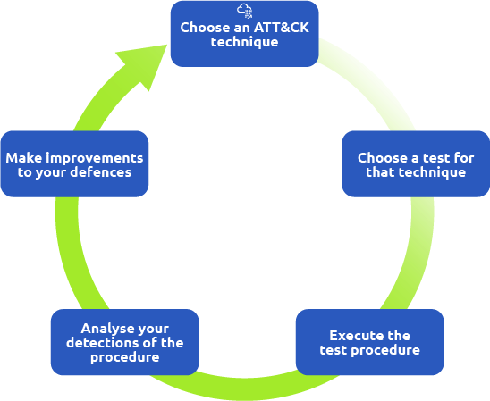

# Threat emulation
<!--StartFragment-->

*   **Purpose of Threat Emulation**:

    *   Helps security teams understand their security posture and defense mechanisms.
    *   Assists in compliance and due diligence without facing actual threats.
    *   Prepares organizations for sophisticated real-time attacks.
    *   Avoids common assumptions about security measures.

*   **Cyber Security Assessment Issues**:

    *   Questions addressed include the effectiveness of people, processes, and technology.
    *   Assessments include red team engagements, vulnerability assessments, and penetration tests.
    *   Each assessment type serves specific purposes in identifying vulnerabilities and improving security posture.

*   **Challenges of Security Assessments**:

    *   Assessments often do not represent real-world threats comprehensively.
    *   Lack of incentivization for Red and Blue teams hinders information sharing.
    *   Emulation aims to address these challenges and provide a holistic security evaluation.

*   **Emulation vs Simulation**:

    *   No standard definition; terms like threat emulation, adversary emulation, attack simulation, and purple teaming are used interchangeably.
    *   Threat emulation involves intelligence-driven impersonation of real-world attack scenarios to test and improve security defenses.
    *   Can be conducted as blind or non-blind operations.
    *   Threat simulation represents adversary functions through predefined and automated attack patterns but does not exactly imitate specific adversaries.

<!--EndFragment-->
<!--StartFragment-->

*   **Key Concepts of Threat Emulation**:

    *   Aligned with the Pyramid of Pain, emphasizing real-world threats and behavior-focused tactics.
    *   Utilizes MITRE ATT\&CK framework and cyber threat intelligence for threat emulation.
    *   Emphasizes transparency between Red and Blue teams to improve security posture collaboratively.
    *   Offers repeatable tasks and automation for continuous security assessments.
    *   Applied in various instances for assessments, improvement, capability development, and professional growth.

*   **Applications of Emulation**:

    *   Assessments & Improvement: Testing personnel, evaluating security processes, and assessing technology.
    *   Capability Development: Creating and applying tools and analytics derived from TTPs.
    *   Professional Development: Facilitating knowledge sharing and collaboration between red and blue teams.

*   **Purpose of Threat Emulation**:

    *   Provides insights for organizations to assess, manage, and enhance their ability to protect systems against adversaries.
    *   Sets the stage for exploring methodologies for conducting successful threat emulation exercises in the subsequent discussion.

<!--EndFragment-->

<!--StartFragment-->

*   **Threat Emulation Methodologies**:

    *   Strategies, plans, and procedures to simulate and test network defenses against adversaries.
    *   Various methodologies exist, each with unique approaches but share the goal of discovering security weaknesses.
    *   Understanding that adversaries follow methodologies and workflows helps organizations plan their emulation exercises effectively.

*   **Integration of Methodologies**:

    *   Methodologies can be combined to formulate a comprehensive emulation plan.

*   **MITRE ATT\&CK Framework**:

    *   Industry-known knowledge base detailing adversarial TTPs observed in real attacks.
    *   Integration with ATT\&CK enhances efficiency in writing reports and mitigations related to experimented behaviors.
    *   The ATT\&CK matrix represents attackers' techniques across 14 tactics, each listing several adversary techniques.
    *   The Navigator, an extension of ATT\&CK, facilitates exploration by creating color-coded heatmap layers of techniques and sub-techniques used by specific adversaries.

*   **Atomic Testing**:

    *   The Atomic Red Team is a library of emulation tests created by Red Canary.
    *   Tests are executed to evaluate security defenses within an organization.
    *   The framework aids in understanding malicious activities and improving defense by providing telemetry from every test.

*   **Mapping to MITRE ATT\&CK**:

    *   Atomic tests are mapped to the MITRE ATT\&CK framework, establishing a link between threat profiles and emulation.
    *   Supports emulation across various platforms, including known operating systems and cloud environments.

<!--StartFragment-->

*   **TIBER-EU Framework**:

    *   Developed for Threat Intelligence-based Ethical Red Teaming in Europe.
    *   Aims to conduct controlled, intelligence-led emulation testing on critical live production systems.
    *   Provides guidelines for stakeholders to test and enhance cyber resilience through controlled adversary actions.

*   **Three-Phase Process**:

    1.  **Preparation Phase**:

        *   Establishes security teams and determines the scope of the test.
        *   Ensures all planning and procurement processes are fulfilled.

    2.  **Testing Phase**:

        *   Threat Intelligence team identifies threat areas and sets up attack scenarios.
        *   Red Team conducts emulation tests against critical functions.
        *   Blue Team assesses defense systems' performance and fosters collaboration among security teams.

    3.  **Closure Phase**:

        *   Emulation team considers reporting and remediation measures.
        *   Each group drafts analysis reports with test details, findings, and recommendations for technical controls, policies, procedures, and awareness training.

<!--EndFragment-->

<!--StartFragment-->

*   **CTID Adversary Emulation Library**:

    *   Developed by the Center for Threat-Informed Defense (CTID), a non-profit organization operated by MITRE Engenuity.
    *   Aims to promote threat-informed defense practices.
    *   Offers an open-source adversary emulation plan library for evaluating capabilities against real-world threats.

*   **Two Approaches to Emulation**:

    1.  **Full Emulation**:

        *   Comprehensive approach emulating specific adversaries like APT29, covering initial access to exfiltration.
        *   Example: APT29 Adversary Emulation repository.

    2.  **Micro Emulation**:

        *   Focuses on emulating behaviors across multiple adversaries, such as file access or process injection techniques.
        *   Existing emulation plans available in the CTID micro emulation plans repository.

*   **Adversary Emulation Process**:

    *   Focuses on developing emulation plans for adversaries utilizing methodologies discussed within the library.

<!--EndFragment-->

<!--StartFragment-->

**Developing Internal Emulation Process**:

1.  **Define Objectives**:

    *   Objectives must be clear, specific, and measurable.
    *   Scope should include targeted systems and data.

2.  **Research Adversary TTPs**:

    *   Gather information about relevant threats, focusing on financially motivated adversaries.
    *   Shortlist adversaries like FIN6, FIN7, and FIN8 targeting retail businesses.

3.  **Select The Emulated Adversary**:

    *   Consider relevance, available threat intelligence, TTP complexity, and available resources.
    *   Select FIN7 due to its relevance and targeting of U.S. retail entities like VASEPY Corp.

4.  **Select The Emulated TTPs**:

    *   Understand FIN7's TTPs such as spear phishing, social engineering, and watering hole attacks.
    *   Visualize TTPs using the ATT\&CK Navigator and construct TTP outlines for emulation.

5.  **Construct TTP Outline**:

    *   Outline includes planned emulation activities, scope, rules of engagement, and TTP implementation details.
    *   Continuous updates are necessary as adversary TTPs evolve, such as with FIN7's changing tactics.

<!--EndFragment-->

<!--StartFragment-->

1.  **Planning the Threat Emulation Engagement: Part 2**

    *   Proper planning is essential to avoid problems like disclosure of private data, data loss, and system downtime.
    *   Planning includes defining rules of engagement, determining needed resources, and establishing communication channels.

2.  **Threat Emulation Plans:**

    *   Collection of resources organizing step-by-step instructions for adversary behaviors based on specific TTPs.
    *   Elements of a well-defined plan include engagement objectives, scope, schedule, rules of engagement, permission to execute, and communication plan.

3.  **Conducting the Emulation:**

    *   Skilled professionals replicate tactics and techniques of the target adversary in a controlled and safe environment.
    *   Resources needed include an attack platform, an analysis platform, and test systems.

4.  **Planning the Deployment:**

    *   Identifying TTPs to emulate and setting up the lab environment effectively.

5.  **Implementation of TTP:**

    *   Involves deploying actual TTPs, such as creating and obfuscating an Initial Access payload for FIN7.

6.  **Detections & Mitigations:**

    *   Cross-team collaboration to detect and mitigate emulated TTPs using standard cybersecurity tools and MITRE's recommendations.

<!--EndFragment-->

<!--StartFragment-->

1.  **Observing Results:**

    *   The Blue Team (observing team) needs to identify artifacts indicating emulation activity.
    *   Analysis of logs, evaluation of event logs, and tracking networking traffic are essential tasks.
    *   Detection rules like YARA rules, particularly for threats like pillowMint.exe malware (e.g., FIN7), are vital.
    *   Results help assess if the TTP (Tactics, Techniques, and Procedures) was successful, blocked, or detected by security measures.

2.  **Documenting & Reporting Findings:**

    *   Teams must document and report the findings.
    *   Documentation serves as empirical evidence for cybersecurity effectiveness.
    *   Reports should cover exercise procedures, execution details according to the emulation plan, encountered impacts, and recommendations to mitigate threats.

<!--EndFragment-->
