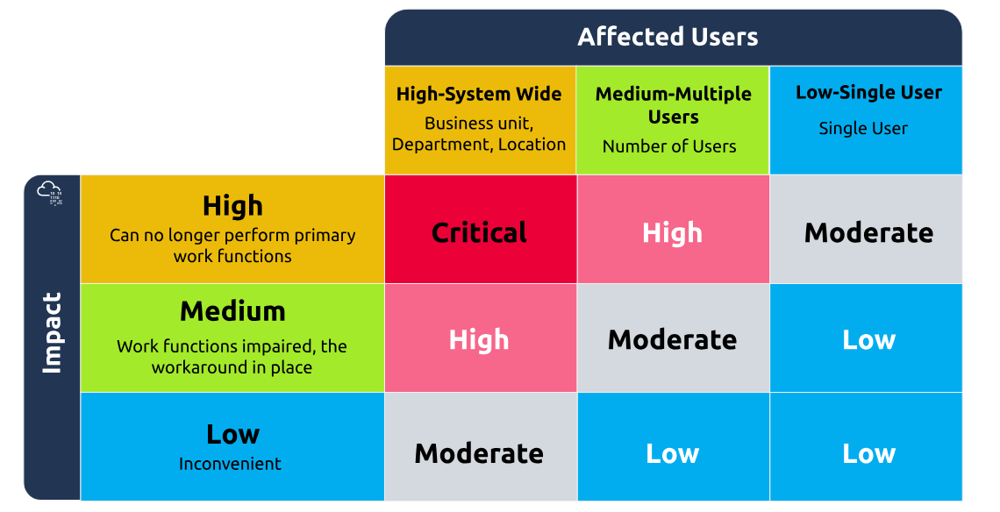

# Inciden Response and Management
- After alert in SOC, triaged and if severity of alert is sufficient, incident is raised.
- Gather data around the alert, like whose account, login occured from where? …

# IR
- Technical aspect, answer what happened?
- Use EDR,AV, SIEM …
- May include Digital Forensics.

# IM
- Answer How do we respond to what happened ?
- Traige to accurately update higher ups, playbook,
- Containment strategy
- Decide on communication plan.

# Levels of incidents
- Level 1: SOC incident, not server, handeled in SOC, like update mail filtering.
- Level 2: CERT incident: several analysts involved, not enough data to raise alarms yet,
- Level 3: CSIRT incident: high alert, entire SOC involved.
- Level 4: CMT incident: full cyber crisis.

# Steps
- Preperation
- Detection
- Analysis and Triage
- Cnotainment
- Eradication
- Recovery

# Becoming an incident Responder
- Volatility of data
<!--StartFragment-->
**1. Registers and Cache**
**2. Routing Table, [ARP]() Cache, Process Table, Kernel Statistics and Memory**
**3. Temporary File Systems**
**4. Disk**
**5. Remote Logging and Monitoring**
**6. Physical Configuration and Network Topology**
**7. Archival Media**
<!--EndFragment-->
- Don't trust the system, like run tools on the victim machine.
- Dont run programs that change access time of files.
- Chain Of Custody.
- Incident playbook.
- Call tree (who to call)
- Containment (network segmentation, physical, virtual [using EDR, only allowed to connect specific hosts])
- BCP/DRP
- Use UTC in time notes to make sure all times match.

# Cyber crisis
- CMT Crisis Management Team
- To label, tryhackme as an aweseo screenshot

- Roles:
    - CMT chair (the lead)
    - Executives (Ceos, ctos, cfos)
    - communication
    - legal
    - operations
    - subject matter experts
    - scribe
- Golder hour (aka first hour of the crisis incident)
- Steps
    - assembly: notify everyone
    - Info gather: csirt briefs everyone
    - crisis triage
    - notifications
- CMT process:
    - info updates
    - traige: determine severity
    - action discussion
    - Action approvals: CMT chair sets time limit, ultimately decision is on CEOs hand.
    - Documentation and crisis closure