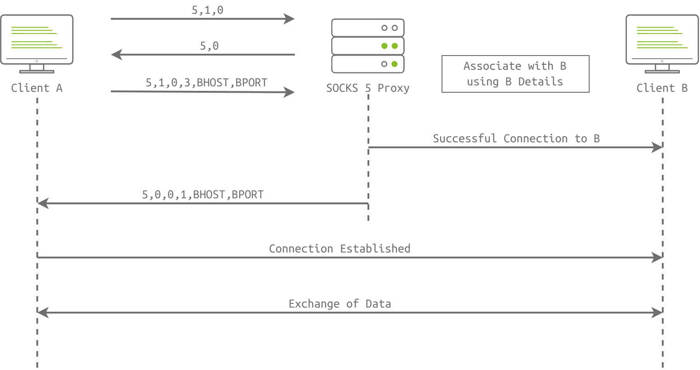

# DNSSEC
<!--StartFragment-->

1.  The [DNS]() zone owner should sign all DNS records using their private key.
2.  The [DNS]() zone publishes its public key so users can check the validity of the DNS records signatures.

<!--EndFragment-->

# GPG
<!--StartFragment-->

`gpg --gen-key`.

<!--EndFragment-->
<!--StartFragment-->

`gpg --encrypt --sign --armor -r strategos@tryhackme.thm message.txt`

Notice the following options:

*   `--encrypt -r recipient@tryhackme.thm` will encrypt `message.txt` using the public key associated with the recipient’s email. This will provide confidentiality.
*   `--sign` will sign our message (using our private key). This will prove authenticity.
*   `--armor` is to produce the output using ASCII instead of binary.

Encrypting using `gpg` created the following message that can be sent seamlessly with an email client.

<!--EndFragment-->

# SOCKS5 Protocol
- Socket Secure (SOCKS) is a proxy protocol for data exchange through a delegate server (SOCKS5 proxy)

