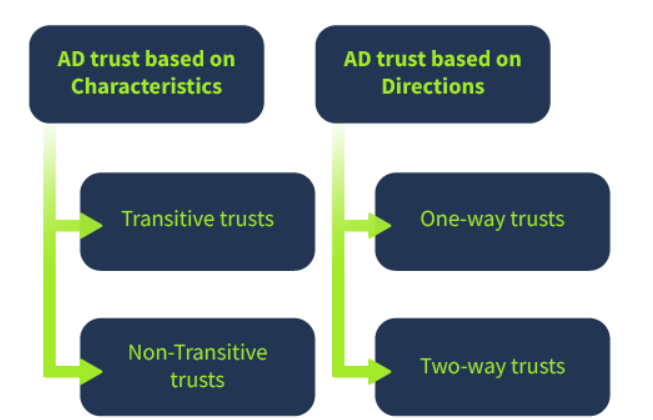
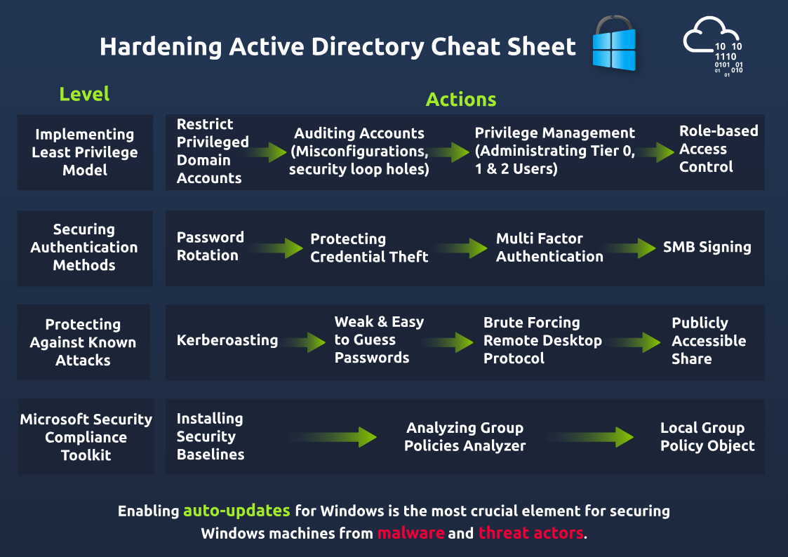

# Basics
- room: https://tryhackme.com/room/activedirectoryhardening
- Domain is the core structure in AD, usually an org represented by a domain.
- Domain Controller is the brain server, supervise the domain.
- Trees: collection of domains
- Forests: Collection of trees.
- Trust: Established communication bridge between domain.

- Transitive means, A trusts B, B trusts C, then A also trusts C.
- See trusts <!--StartFragment-->

Server Manager > Tools > Active Directory Domains and Trust

<!--EndFragment-->
- Server manager, add roles and feaures.

# Secure Authentication
- Disable LAN manager hash cause its weaker <!--StartFragment-->

`Group Policy Management Editor >(Inside the domain, might need to add new policy) Computer Configuration > Policies > Windows Settings > Security Settings > Local Policies > Security Options > double click Network security - Do not store LM hash value on next password change policy > select "Define policy setting" `

<!--EndFragment-->
- Ensure SMB signing for both client and server to ensure SMB packet integrity <!--StartFragment-->

`Group Policy Management Editor >(Inside the domain, might need to add new policy) Computer Configuration > Policies > Windows Settings > Security Settings > Local Policies > Security Options > double click Microsoft network server: Digitally sign communication (always) > select Enable Digitally Sign Communications`
<!--EndFragment-->

-  LDAP signing is a Simple Authentication and Security Layer (SASL) property that only accepts signed LDAP requests and ignores other requests (plain-text or non-SSL). <!--StartFragment-->

Group Policy Management Editor > Computer Configuration > Policies > Windows Settings > Security Settings > Local Policies > Security Options > Domain controller: LDAP server signing requirements > select Require signing from the dropdown

<!--EndFragment-->
- Password rotation: script to autochange, MFA or Group Managed Services Accounts (gMSAs)
- Password Policy: <!--StartFragment-->

`Group Policy Management Editor > Computer Configuration > Policies > Windows Settings > Security Settings > Account Policies > Password Policy`

<!--EndFragment-->

# Least Privilege Model
-  **User accounts**: You must promote using regular user accounts for most people in the network, who are necessary to perform their regular duties.
- **Privilege account**s: These are the accounts with elevated privileges and are further classified as first and second privilege accounts. 
- **Shared accounts**: These accounts are shared amongst a group of people, as the visitors with bare minimum privileges, to give limited access for a specific time. These accounts are not recommended and must be utilised in limited scenarios.
- <!--StartFragment-->

*   **Tier 0**: Top level and includes all the admin accounts, Domain Controller, and groups.
*   **Tier 1**: Domain member applications and servers. 
*   **Tier 2**: End-user devices like HR and sales staff (non-IT personnel).

<!--EndFragment-->

# Compliance audit tool
https://www.microsoft.com/en-us/download/details.aspx?id=55319

# Cheatsheet from tryhackme

# Extra rooms:
<!--StartFragment-->
*   [Active Directory basics ](https://tryhackme.com/jr/winadbasics)
*   [Breaching Active Directory ](https://tryhackme.com/room/breachingad)
*   Standard technologies used in[ the corporate environment](https://tryhackme.com/room/thelayoftheland)
*   [Zero Logon ](https://tryhackme.com/room/zer0logon)(Get admin access to an [AD]() without credentials).
*   [Breaching AD ](https://tryhackme.com/room/breachingad)(Getting the first set of credentials in an [AD]() environment).
*   [Exploiting AD](https://tryhackme.com/room/exploitingad) (Learn common [AD]() exploitation techniques).
*   [Post-Exploitation](https://tryhackme.com/room/postexploit) basics (What an attacker does after gaining an initial foothold of [AD]()).

<!--EndFragment-->

