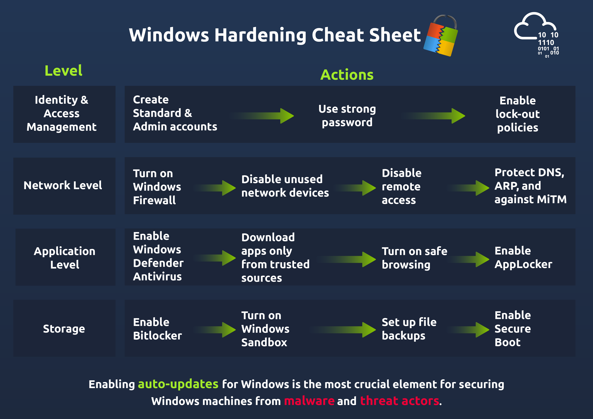

# General Concepts
- Services, background process. see via `services.msc`.
- Configuration in windows registry, `regedit`.
- See event logs in `event viewer`.

# IAM
- Standard and admin account.
- User Account Control (UAC) enhances access controls, ensures services/apps run on non admin accounts.
- `Control Panel -> User Accounts -> user Account and control settings`, select when to notify.
- Local Policy and Group Policy editor, lockout policy, password policy.
- List users, cmd `net user`, powershell `Get-LocalUser`.

# Network management
- Windows defender firewall, `WF.msc`, disable incomming traffic for personal computers.
- <!--StartFragment-->

 it has three main profiles `Domain, Public and Private`.  The Private profile must be activated with "Blocked Incoming Connections" while using the computer at home

<!--EndFragment-->

- Disable unused networking devices.
<!--StartFragment-->

Control panel > System and Security Setting > System > Device Manager

<!--EndFragment-->
- Disable SMB protocol
<!--StartFragment-->

Disable-WindowsOptionalFeature -Online -FeatureName SMB1Protocol

<!--EndFragment-->

- Be careful of hosts file in
<!--StartFragment-->

C:\Windows\System32\Drivers\etc\hosts

<!--EndFragment-->

- MITM attaks check arp entires using `arp -a` and to clear `arp -d`.

# Application management
- Only download from windows store.
- Go to `Setting > Select Apps and Features` and then select `The Microsoft Store only`
- Microsoft office hardening https://learn.microsoft.com/en-us/microsoft-365/security/defender-endpoint/attack-surface-reduction-rules-reference?view=o365-worldwide
- Applocker:  `Local Group Policy Editor > Windows settings > Security Settings > Application Control Policies > AppLocker`.
- MsEdge. To turn on the Smart Screen, go to `Settings > Windows Security > App and Browser Control > Reputation-based Protection`. Scroll down and turn on the `SmartScreen option`.

# Storage Management
- Bitlocker for encryption <!--StartFragment-->

Start > Control Panel > System and Security > BitLocker Drive Encryption

<!--EndFragment-->
- Windows sandbox, feature to run app in a lightwegith sandbox environment, once sandbox closed, everything is deleted,
<!--StartFragment-->

Click Start > Search for 'Windows Features' and turn it on > Select Sandbox > Click OK to restart 

<!--EndFragment-->
- Windows Secure boot, check if running on trusted hardware, already in secure boot enrivonment if BIOS mode is UEFI, check secure boot state in `msnifo32`.
- Backup <!--StartFragment-->

Settings > Update and Security > Backup

<!--EndFragment-->

# Update Windows
# Cheatsheet
