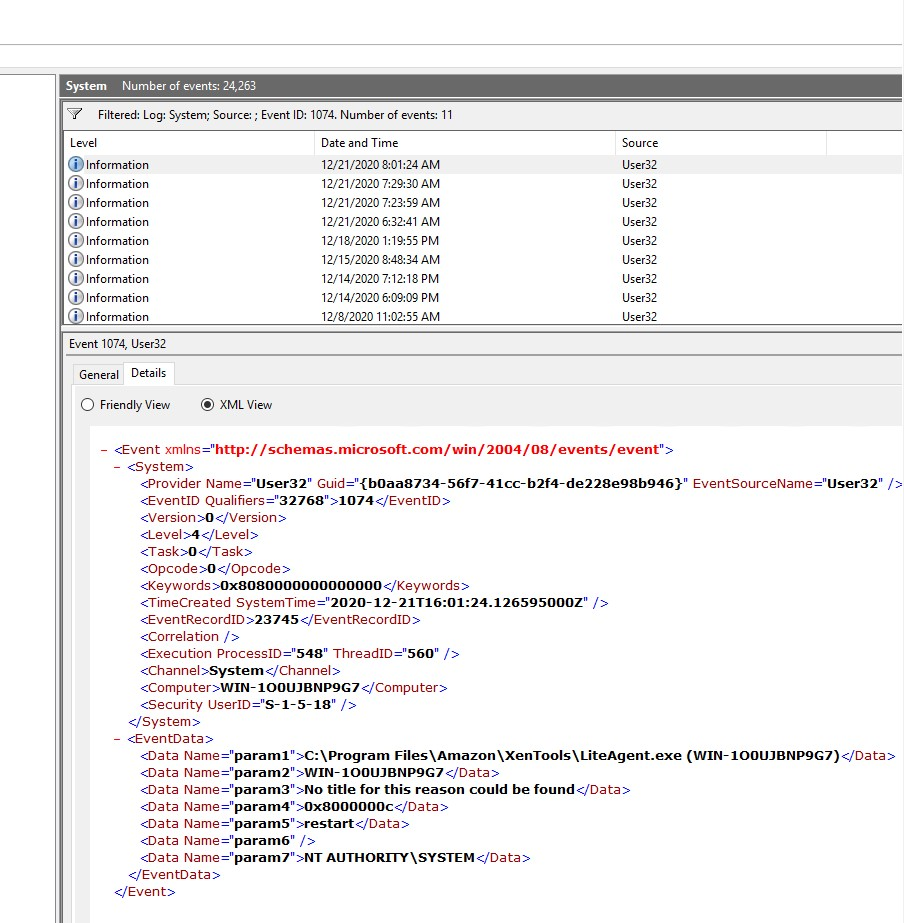
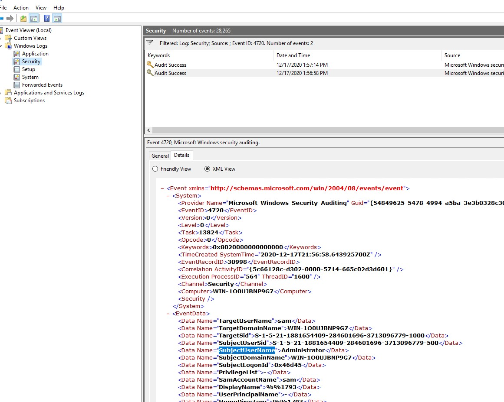

`NOTE: These notes are derived from the following sources:`
1. https://tryhackme.com/room/introtoendpointsecurity
2. https://www.sans.org/posters/hunt-evil/
3. https://learn.microsoft.com/en-us/sysinternals/resources/windows-internals

## Windows
- Normal windows process 
  - System
  - System > smss.exe
  - csrss.exe
  - wininit.exe
  - wininit.exe > services.exe
  - wininit.exe > services.exe > svchost.exe
  - lsass.exe
  - winlogon.exe
  - explorer.exe
- Common tools that could be used
  - Event Viewer (GUI-based application)
  - Wevtutil.exe (command-line tool)
  - Get-WinEvent (PowerShell cmdlet)
  - sysmon
  - osquery (Enter cli with `osqueryi`)
  - wazuh
  - Sysinternals https://docs.microsoft.com/en-us/sysinternals/downloads/
- Sysinternals
  - `sigcheck` file check, even virustotal check . Ex: `sigcheck -u -e C:\Windows\System32`
  - `streams` to check files in ADS. use `streams file.txt`. It will show the alternate stream filename. use notepad to look at it `notepad file.txt:ads.txt`
  - `sdelete` secure delete
  - `tcpview` or `resmon` for network monitoring
  - `autoruns` look at value that will run on startup
  - `procdump` `process explorer` `process monitor`
  - `psexec` execute command remotely
  - `sysmon` for detailed logging
  - `winobj` to see NT objects stuff ?
  - `bginfo` get background running processes
  - `regjump` takes a reg path and open in UI, i dont know how usefule it is, but is convinient
  - `strings` we know
- Processes
  - task manager, processes hacker, process explorer `Publisher` author of program.
  - Process named `System`. `special kind of thread that runs only in kernel mode a kernel-mode system thread`. Its normal behavior are
      - PID will always be 4
      - In task manager
        - Image Path:  N/A
        - Parent Process:  None
        - Number of Instances:  One
        - User Account:  Local System
        - Start Time:  At boot time
      - In process hacker
        - Image Path: C:\Windows\system32\ntoskrnl.exe (NT OS Kernel)
        - Parent Process: System Idle Process (0)
   - `smss.exe`
      - `Session Manager Subsystem`
      - aka `Windows Session Manager`
      - responsible for creating new sessions
      - starts `csrss.exe` (Windows subsystem) and `wininit.exe` in Session 0
      - starts `csrss.exe` and `winlogon.exe` for Session 1
      - first child instance creates child instances in new sessions, done by smss.exe copying itself into the new session and self-terminating
      - https://en.wikipedia.org/wiki/Session_Manager_Subsystem
      - also responsible for `creating environment variables`, `virtual memory paging files` and starts `winlogon.exe` (the Windows Logon Manager).
      - Normal Behavior
        - Image Path:  `%SystemRoot%\System32\smss.exe`
        - Parent Process:  `System`
        - Number of Instances:  `One master instance and child instance per session. The child instance exits after creating the session.`
        - User Account:  `Local System`
        - Start Time:  `Within seconds of boot time for the master instance`
      - Abnormal Behavior
        - A different parent process other than System (4)
        - The image path is different from C:\Windows\System32
        - More than one running process. (children self-terminate and exit after each new session)
        - The running User is not the `SYSTEM` user
        - Unexpected registry entries for Subsystem
    - `crss.exe`
      - `Client Server Runtime Process`
      - `always running and is critical to system operation.`
      - responsible for the Win32 console window and process thread creation and deletion
      - responsible for making the Windows API available to other processes, mapping drive letters, and handling the Windows shutdown
      - https://en.wikipedia.org/wiki/Client/Server_Runtime_Subsystem
      - Normal Behavior
        - Image Path:  `%SystemRoot%\System32\csrss.exe`
        - Parent Process:  `Created by an instance of smss.exe`
        - Number of Instances:  `Two or more`
        - User Account:  `Local System`
        - Start Time:  `Within seconds of boot time for the first two instances (for Session 0 and 1). Start times for additional instances occur as new sessions are created, although only Sessions 0 and 1 are often created.`
      - Abnormal Behavior
        - An actual parent process. (smss.exe calls this process and self-terminates)
        - Image file path other than C:\Windows\System32
        - Subtle misspellings to hide rogue processes masquerading as csrss.exe in plain sight
        - The user is not the `SYSTEM` user.
    - `wininit.exe`
      - Windows Initialization Process
      - responsible for launching `services.exe` (Service Control Manager), `lsass.exe` (Local Security Authority), and `lsaiso.exe` within `Session 0 `
      - Note: lsaiso.exe is a process associated with Credential Guard and KeyGuard. You will only see this process if Credential Guard is enabled. 
      - Normal Behavior
        - Image Path:  `%SystemRoot%\System32\wininit.exe`
        - Parent Process:  `Created by an instance of smss.exe`
        - Number of Instances:  `One`
        - User Account:  `Local System`
        - Start Time:  `Within seconds of boot time`
      - Abnormal Behavior
        - An actual parent process. (smss.exe calls this process and self-terminates)
        - Image file path other than C:\Windows\System32
        - Subtle misspellings to hide rogue processes in plain sight
        - Multiple running instances
        - Not running as SYSTEM
    - `services.exe`
      - Service Control Manager (SCM) 
      - handle system services. `loading services, interacting with services and starting or ending services`
      - maintains a database that can be queried using a Windows built-in utility, `sc.exe`
      - Informaiton related to services are stored in `HKLM\System\CurrentControlSet\Services`
      - When a user logs into a machine successfully, this process is responsible for setting the value of the Last Known Good control set (Last Known Good Configuration), HKLM\System\Select\LastKnownGood, to that of the CurrentControlSet.
      - Parent to several process including `svchost.exe, spoolsv.exe, msmpeng.exe, and dllhost.exe`.
      - Normal Behavior
        - Image Path: `%SystemRoot%\System32\services.exe`
        - Parent Process:  `wininit.exe`
        - Number of Instances:  `One`
        - User Account:  `Local System`
        - Start Time:  `Within seconds of boot time`
      - Abnormal Behavior
        - `A parent process other than wininit.exe`
        - `Image file path other than C:\Windows\System32`
        - `Subtle misspellings to hide rogue processes in plain sight`
        - `Multiple running instances`
        - `Not running as SYSTEM`
    - ` svchost.exe`
      - `wininit.exe > services.exe > svchost.exe`
      - `Service Host (Host Process for Windows Services)`
      - responsible for hosting and managing Windows services
      - This process loads a service as a dll. so the services are written as dll.
      - The service info will be in `HKLM\SYSTEM\CurrentControlSet\Services\SERVICE NAME\Parameters`
      - `-k Dcomlaunch -p` is the command arguement
      - Multiple instances of svchost.exe will be there, so common target for malware authors to masquared as.
      - Normal Behavior
        - Image Path: `%SystemRoot%\System32\svchost.exe`
        - Parent Process: `services.exe`
        - Number of Instances: `Many`
        - User Account: `Varies (SYSTEM, Network Service, Local Service) depending on the svchost.exe instance. In Windows 10, some instances run as the logged-in user`.
        - Start Time: `Typically within seconds of boot time. Other instances of svchost.exe can be started after boot.`
      - Abnormal Behavior
        - A parent process other than services.exe
        - Image file path other than C:\Windows\System32
        - Subtle misspellings to hide rogue processes in plain sight
        - The absence of the -k parameter
    - `lsass.exe`
      - `responsible for enforcing the security policy on the system`
      - `creates security tokens for SAM (Security Account Manager), AD (Active Directory), and NETLOGON.`
      - uses authentication packages specified in `HKLM\System\CurrentControlSet\Control\Lsa`
      - Normal Behavior
        - Image Path:  `%SystemRoot%\System32\lsass.exe`
        - Parent Process:  `wininit.exe`
        - Number of Instances:  `One`
        - User Account:  `Local System`
        - Start Time:  `Within seconds of boot time`
      - Abnormal Behavior
        - A parent process other than wininit.exe
        - Image file path other than C:\Windows\System32
        - Subtle misspellings to hide rogue processes in plain sight
        - Multiple running instances
        - Not running as SYSTEM
    - `winlogon.exe`
      - handling the Secure Attention Sequence (SAS). It is the ALT+CTRL+DELETE key combination users press to enter their username & password.
      - responsible for loading the user profile
      - Loads the user's `NTUSER.DAT` into HKCU, and userinit.exe loads the user's shell
      - also responsible for locking the screen and running the user's screensaver, among other functions
      - Normal Behavior
        - Image Path:  `%SystemRoot%\System32\winlogon.exe`
        - Parent Process:  `Created by an instance of smss.exe that exits, so analysis tools usually do not provide the parent process name.`
        - Number of Instances:  `One or more`
        - User Account:  `Local System`
        - Start Time:  `Within seconds of boot time for the first instance (for Session 1). Additional instances occur as new sessions are created, typically through Remote Desktop or Fast User Switching logons.`
      - Abnormal Behavior
        - An actual parent process. (smss.exe calls this process and self-terminates)
        - Image file path other than C:\Windows\System32
        - Subtle misspellings to hide rogue processes in plain sight
        - Not running as SYSTEM
        - Shell value in the registry other than explorer.exe  
      - https://en.wikipedia.org/wiki/Winlogon
    - `explorer.exe`
      - Gives user access to files and folder
      - winlogon.exe -> userinit.exe, which launches the value in HKLM\Software\Microsoft\Windows NT\CurrentVersion\Winlogon\Shell. 
      - Userinit.exe exits after spawning explorer.exe. Because of this, the parent process is non-existent.
      - Normal Behavior
        - Image Path:  `%SystemRoot%\explorer.exe`
        - Parent Process:  `Created by userinit.exe and exits`
        - Number of Instances:  `One or more per interactively logged-in user`
        - User Account:  `Logged-in user(s)`
        - Start Time:  `First instance when the first interactive user logon session begins`
      - Abnormal Behavior
        - An actual parent process. (userinit.exe calls this process and exits)
        - Image file path other than C:\Windows
        - Running as an unknown user
        - Subtle misspellings to hide rogue processes in plain sight
        - Outbound TCP/IP connections.
- Event Logs
  - Read with event viewr or `wevtutil.exe`  `https://learn.microsoft.com/en-us/windows-server/administration/windows-commands/wevtutil`
  - From powershell `Get-WinEvent`. `https://learn.microsoft.com/en-us/powershell/module/microsoft.powershell.diagnostics/Get-WinEvent?view=powershell-7.3&viewFallbackFrom=powershell-7.1`. use `-Path path_to_.evtx` to look from a custom file
  - Xpath. `Get-WinEvent -LogName Security -FilterXPath '*/EventData/Data[@Name="TargetUserName"]="System"' -MaxEvents 1`. See xml data in details
  - For xpath, starts with *.
  - Each element becomes a word. `<EventData>` becomes `/EventData`1
  - Ex:
  - 
  
  - We can use `Get-WinEvent -LogName System -FilterXPath '*/System/TimeCreatedTime="2020-12-15T01:09:08.940277500Z" and */System/Provider[@Name="WLMS"]'`.
  - in above, `*` to get all first level, then `System` next level and then filter accordingly.
  - Another Example
  - 
  -  `Get-WinEvent -LogName Security -FilterXPath '*/EventData/Data[@Name="SubjectUserName"]="Administrator" and */System/EventID=4720'`
  -  https://static1.squarespace.com/static/552092d5e4b0661088167e5c/t/580595db9f745688bc7477f6/1476761074992/Windows+Logging+Cheat+Sheet_ver_Oct_2016.pdf
