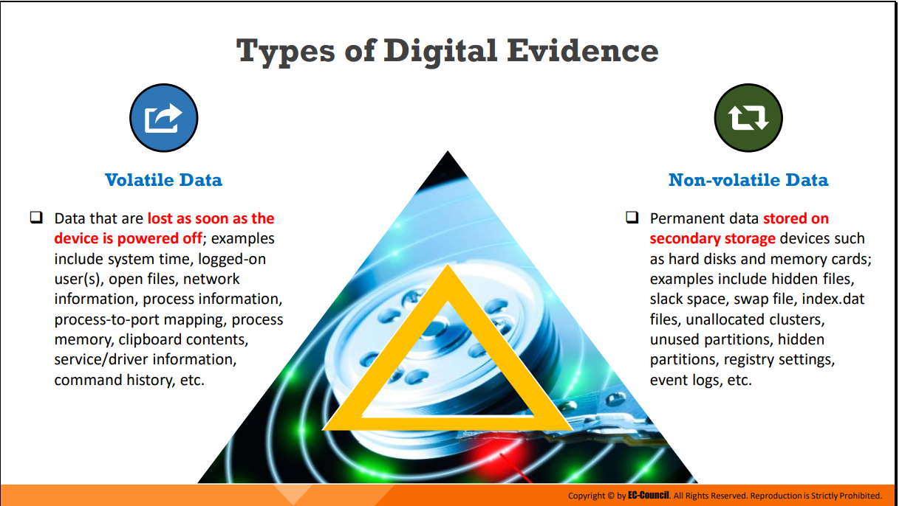

# Chapter-1
- Computer forensics is a part of digital forensics that deals with crimes committed across computing devices such as networks, computers, and digital storage media.
- Objectives of Computer Forensics:
         Identify, gather, and preserve the evidence of a cybercrime
         Identify and gather evidence of cybercrimes in a forensically sound manner
         Track and prosecute the perpetrators in a court of law
         Interpret, document, and present the evidence such that it is admissible during
        prosecution
         Estimate the potential impact of malicious activity on the victim and assess the intent of
        the perpetrator
         Find vulnerabilities and security loopholes that help attackers
         Understand the techniques and methods used by attackers to avert prosecution and
        overcome them
         Recover deleted files, hidden files, and temporary data that can be used as evidence
         Perform incident response (IR) to prevent further loss of intellectual property, finances,
        and reputation during an attack
         Know the laws of various regions and areas, as digital crimes are widespread and remote
         Know the process of handling multiple platforms, data types, and operating systems
         Learn to identify and use the appropriate tools for forensic investigations
         Prepare for incidents in advance to ensure the integrity and continuity of network
        infrastructure
         Offer ample protection to data resources and ensure regulatory compliance
         Protect the organization from similar incidents in the future
         Help counteract online crimes such as abuse, bullying, and reputation damage
         Minimize the tangible and intangible losses to an organization or an individual
         Support the prosecution of the perpetrator of a cybercrime

<!--StartFragment-->

Espionage: Corporate espionage is a central threat to organizations because competitors often attempt to secure sensitive data through open-source intelligence gathering. Through this approach, competitors can launch similar products in the market, alter prices, and generally undermine the market position of a target organization.

<!--EndFragment-->
<!--StartFragment-->

Cyber defamation: It an offensive activity wherein a computer or device connected to the web is employed as a tool or source point to damage the reputation of an organization or individual. Sending defamatory emails or posting defamatory statements on social media can damage the reputation of the target organization or entity to a great extent

<!--EndFragment-->

