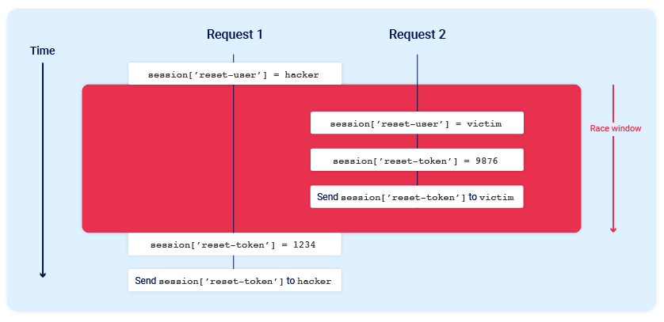

# Race Condition
- Probe for request.
- See the respionse, send in parallel.
<!--StartFragment-->

*   Redeeming a gift card multiple times
*   Rating a product multiple times
*   Withdrawing or transferring cash in excess of your account balance
*   Reusing a single CAPTCHA solution
*   Bypassing an anti-brute-force rate limit

<!--EndFragment-->
- Send to repeater, use "cmd + R".
- "+" sign in repeater, create group, send in parallel.

## Turbo intruder
- It has some cool stuffs.
- Obviously it must support HTTP2 to send multiple request in the same TCP connections due to limitation of HTTP1.
```python
# Find more example scripts at https://github.com/PortSwigger/turbo-intruder/blob/master/resources/examples/default.py
def queueRequests(target, wordlists):
    engine = RequestEngine(endpoint=target.endpoint,
                           concurrentConnections=1,
                           engine=Engine.BURP2
                           )

    # queue 20 requests in gate '1'
    for word in open('/home/nishan/pass.txt'):
        engine.queue(target.req, word.rstrip(),gate="1")
    engine.openGate('1')

def handleResponse(req, interesting):
    table.add(req)
```

# Hidden Multi-Step sequences
- methodology
1. Predict potential collisions
   - Is this endpoint ciritical or not ?
   - Is there any collision potential? Does same request affect same record?
2. Probe for clues
   - Send requests, sequentially (group it?) or parallely, see for any differences.
  
3. Prove the concepts

# Multi endpoint race conditions

- send request when the payment is being validated.
- Like when payment is being validated, add another item in the basket.
- Our test might not work correctly, due to "network delay", "delay in specific endpoint processing".
- U can use "connection warming", make a inconsequential request in the beginning (add in front of tab group), and send rest.

# Single-endpoint race conditions

<!--StartFragment-->

Consider a password reset mechanism that stores the user ID and reset token in the user's session.

In this scenario, sending two parallel password reset requests from the same session, but with two different usernames, could potentially cause the following collision:

<!--EndFragment-->
<!--StartFragment-->

Email address confirmations, or any email-based operations, are generally a good target for single-endpoint race conditions. Emails are often sent in a background thread after the server issues the HTTP response to the client, making race conditions more likely.

<!--EndFragment-->

- Updating email address
- Send ur email address and then victims, in parallel, think of other endpoints that might have the impact.

# Session-based locking mechanisms
- Try usiing different session token.
